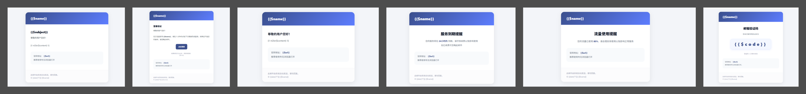

### Xboard邮件模板


#### 效果展示




#### 使用方法

> 进入你的邮件模板 `resources/views/mail` 

> 拉去最新的邮件模板

```shell
git clone https://github.com/xlee7s/HuaXianRenMail.git
```

> Xboard后台配置刚刚下载的模板即可


#### 配合自动发邮件项目

项目地址: [CronMailSender](https://github.com/xlee7s/CronMailSender)